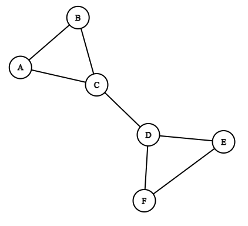
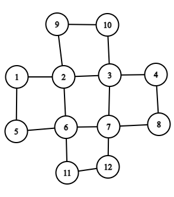

# CSE 280 Prove 6

(c) BYU-Idaho - It is an honor code violation to post this
file completed or uncompleted in a public file sharing site. S4.

**Instructions**: Answer each question using proper markdown notation as needed.  Use the preview view in Visual Studio Code (or another editor if desired) to see the formatting, tables, and mathematical formula properly rendered.  If you need to write code, then first test your code in a separate file and then copy the code into this document using code fences. 

**Name**: Sayal Neupane

## Question 1 (5 points)

Fill in the adjacency table below for the graph below:


|Vertex|Adjacent Verticies|
|:-:|:-:|
|0|{1, 4, 3, 2}|
|1|{0, 2, 3, 4}|
|2|{0, 1, 3}|
|3|{2, 0, 1, 4}|
|4|{1, 0, 3}|

## Question 2 (8 points)

The list of 9 graphs below have 4 pairs of isomorphic graphs.  Find the 4 pairs.  Note that one of the graphs does not have a match.


|#|Isomorphic Pairs|
|:-:|:-:|
|1st Pair|a & f|
|2nd Pair|c & g|
|3rd Pair|b & i|
|4th Pair|d & e|

Source: Question adapted from Applied Discrete Structures by Alan Doerr & Kenneth Levasseur which is licensed under a Creative Commons Attribution-NonCommercial-ShareAlike 3.0 United States License.

## Question 3 (4 points)

Write python code to create an adjacency table for the undirected graph below.  Second, implement the `find_neighbors` function which will take as input vertex and the adjaceny table and returns a list of verticies that are adjacent to the input vertex.  Finally, implement the `is_neighbor` which takes two verticies and the adjaceny table and returns True if they are adjacent; False otherwise.



```python
adjacency_table = {"A": ["B","C"], 
                   "B": ["A","C"],
                   "C": ["A","B","D"],
                   "D": ["C","E","F"],
                   "E": ["D","F"],
                   "F": ["D","E"]}

def find_neighbors(vertex, adjaceny_table):
    return adjacency_table[vertex]

def is_neighbor(vertex1, vertex2, adjacency_table):
    if vertex2 in adjacency_table[vertex1]:
        return True
    else:
        return False

print(find_neighbors('A', adjacency_table)) # should print ['B', 'C']
print(find_neighbors('D', adjacency_table)) # should print ['C', 'E', 'F']

print(is_neighbor('A','B',adjacency_table)) # True
print(is_neighbor('D','F',adjacency_table)) # True
print(is_neighbor('C','F',adjacency_table)) # False
```

## Question 4 (12 points)

Determine if the graph below has an Euler Circuit.  If it does, then write down the sequence of verticies that make up the Euler Circuit.  If it does not, then write "No Euler Circuit"

|Graph|Euler Circuit|
|:-:|:-:|
||No Euler Circuit|
||{6, 1, 2, 3, 4, 5, 1, 4, 6}|
||{1, 5, 6, 11, 12, 7, 8, 4, 3, 10, 9, 2, 6, 7, 3, 2, 1}|

## Question 5 (16 points)

Complete the tables below to identify the final state (per the FSM diagram) and whether that final state was an accepting state for each of the inputs.   

**Part 1**


|Input|Final State|Accepting (Yes/No)|
|:-:|:-:|:-:|
|00101|D|No|
|011100|C|Yes|
|01111|B|No|
|0101|D|No|
|00000|C|Yes|
|11111|D|No|
|11100|D|No|
|10011|D|No|

**Part 2**


|Input|Final State|Accepting (Yes/No)|
|:-:|:-:|:-:|
|00101|S5|No|
|011100|S2|No|
|01111|S4|Yes|
|0101|S3|No|
|00000|S5|No|
|11111|S4|Yes|
|11100|S2|No|
|10011|S4|Yes|

## Question 6 (5 points)

Describe the bit string recognized/accepted by the following FSM:


Answer: In this FSM, our input are 0 and 1 only and, we can see if we have 1 as input at the end, we will have our final state at B which makes final state accepting. If we have 0 at the end no matter what in before we will end our final state at A which is not accepting. So from this we can conclude that have 1 at end makes our final state accepting state and if 0 it will make final state not accepting.